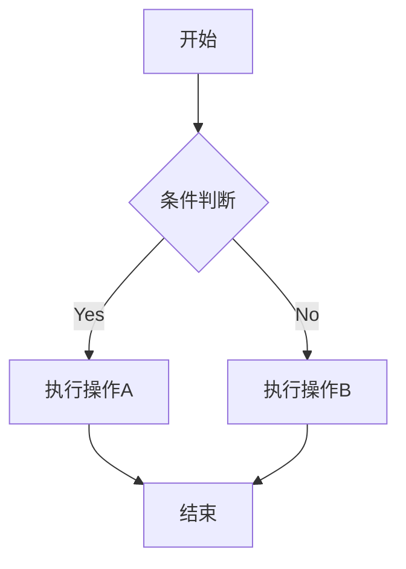

# This is for test use

please place your passage in `/public/articles`.

## A British joke

Why did the British man bring a ladder to the pub? He heard the drinks were on the house.  

## mermaid



## Audio

<audio controls src="%path%/1.aac" />

## JS

```js
aleart("Welcome to Java!")
```
