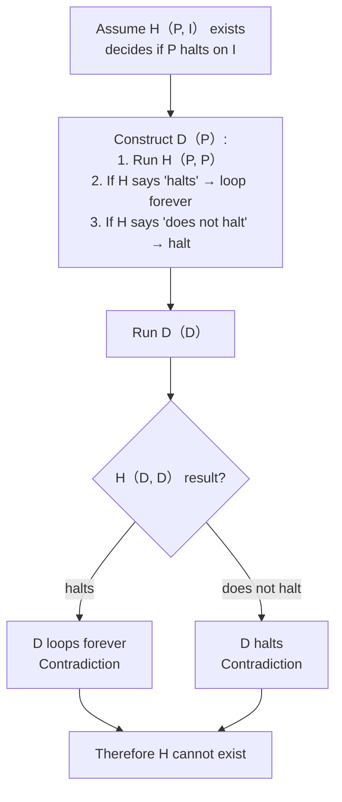

# 关于自指问题的若干研究

cato: review  
labels:

- language
- math
- philosophy

---

## 自然语言

`我说的这句话是假话`

## 集合论

Russell's paradox  
  
$A=\{A|A\notin A\}$, then does $A \in A$?  
if $A\in A$: $A \notin A$  
if $A\notin A$: $A\in A$  
Thus, such set doesn't exist.

## 停机问题

The halting problem is undecidable because assuming a solution leads to a logical contradiction, as shown by Alan Turing in 1936. Here’s a brief proof sketch:

1. **Assume** there exists a program （or Turing machine） `H（P, I）` that can decide whether any program `P` halts when given input `I`. It outputs "halts" or "does not halt".

2. Using `H`, construct a new program `D` that takes a program `P` as input and does the following:
   - Call `H（P, P）` to determine whether `P` halts when given itself as input.
   - If `H` says "halts", then `D` goes into an infinite loop （does not halt）.
   - If `H` says "does not halt", then `D` immediately halts.

3. Now ask: what happens when `D` is run with itself as input, i.e., `D（D）`?
   - If `D（D）` halts, then `H（D, D）` would say "halts", causing `D` to loop forever — contradiction.
   - If `D（D）` does not halt, then `H（D, D）` would say "does not halt", causing `D` to halt — contradiction.

Therefore, the program `H` cannot exist. No universal halting decider is possible.

### A Graph to help you understand

## **Curry’s Paradox** (self-referential implication)  

Consider the sentence: *“If this sentence is true, then Santa Claus exists.”*  
Let $ S $ be “$ S \rightarrow P $” where $ P $ is any proposition.  

- Assume $ S $ is true. Then $ S \rightarrow P $ gives $ P $ (by modus ponens).  
- Thus $ S \rightarrow P $ holds (we assumed $ S $ and derived $ P $).  
- But $ S $ *is* $ S \rightarrow P $, so $ S $ is true.  
- Therefore $ P $ is true — any statement can be proved.

## **Cantor’s Diagonal Argument** ( Valid in $\text{ZFC}$ )  

Proves that the set of all infinite binary sequences is uncountable.  

- List all sequences $s_1, s_2, \dots$.  
- Construct a new sequence where the $n$-th bit is the opposite of the $n$-th bit of $s_n$.  
- This new sequence differs from every listed sequence, contradicting the assumption that the list was complete.

---
time: 2026-04-12
